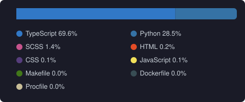

# Hi, I'm Dhafin 👋

Lead Software Engineer at **[C-Cube International B.V.](https://www.c-cube-international.com/)** — I build and maintain the **C-Cube Dashboard**, a corrosion and coating integrity platform that helps clients evaluate the structural health of industrial assets including storage tank refineries, offshore wind farms, and more.

I'm passionate about full-stack development and machine learning, with a focus on building reliable, data-driven tools for the industrial inspection space.

---

## 🛠️ Tech Stack

**Frontend**

**Backend**

**Infrastructure & Cloud**

**Data & ML**

---

## 💼 What I'm Working On

- 🏭 **C-Cube Dashboard** — a full-stack integrity management platform for industrial asset inspection, featuring 3D model visualisation, sensor data analysis, and inspection record management
- 🤖 Exploring ML applications in corrosion detection and predictive asset health monitoring

---

## 📊 GitHub Stats

**C-Cube Dashboard language breakdown** — aggregated across the private C-Cube Dashboard repos, updated weekly:

  

---
